# 溯讀使用手冊（學生版）

這份手冊寫給使用溯讀的同學：溯讀是什麼、怎麼一步一步讀、七日自主試用要做什麼和怎麼記錄、可以打哪些字、遇到問題怎麼辦。全篇用同一句話當例子：

> 人工智慧表現得越來越像人類，所以它已經具備意識。

**關於圖片**：手冊裡的聊天畫面是用程式實際送出的訊息離線重畫的，**不是 Messenger 截圖**，圖上沒有真實使用者的帳號或對話。搜尋結果和 JEV 的回答是 2026-10-04 對這句話實際跑出來的；只有「處理進度」那一則是依程式的進度格式畫出處理到一半的樣子（示意）。你自己試的時候，來源和數字可能不同，因為網路上的文章會變。

## 目錄

- [開始之前](#開始之前)
- [一、溯讀是什麼](#一溯讀是什麼)
- [二、跟著例子走一遍](#二跟著例子走一遍)
- [三、七日自主試用：要做什麼](#三七日自主試用要做什麼)
- [四、指令速查](#四指令速查)
- [五、疑難雜症](#五疑難雜症)
- [用詞](#用詞)

## 開始之前

- **入口**：Messenger 粉專的私訊連結由老師提供。傳了「你好」沒有回應，請看 [疑難雜症](#五疑難雜症)。
- **隱私**：你貼的文字會交給 Tavily（搜尋）和 TypeSafe（JEV）處理。不要貼私訊、個資、帳號密碼或任何金鑰。

## 一、溯讀是什麼

你貼上一句話（或一則新聞、一個公開網址），溯讀去找相關的來源，用 JEV 比對「來源怎麼寫你這句話的每一段」，再一步一步帶你讀。它**不判斷真假**，也不給「假消息百分比」；它幫你看清楚：哪一段有來源這樣寫、哪一段來源寫得不一樣、哪一段根本沒人提到，接下來還要查什麼。

結構上的特點：

| 特點 | 意思 |
|---|---|
| 句子切成「段」 | 依標點把你的句子切開，每一段分開比對（最多 6 段）。一句話裡常常藏著好幾個說法。 |
| 四步路線 | 引讀 A：📌 本題重點 → 🔎 逐段 → 📊 來源細讀 → 🧩 還缺什麼。每一則訊息的「閱讀位置」寫出你在第幾步。 |
| 兩種引讀（A/B 測試） | 引讀 A 先看全句，再往下追；引讀 B 先一個來源一個來源讀，最後才合起來看。用的是同一批來源和同一組 JEV 數據，只有順序和圖的畫法不同。 |
| 兩張圖 | 🗺 溯讀圖：你的每一段，所有來源合起來怎麼寫。📊 來源細讀：一個來源和你的句子的關係。 |
| 每頁最多四個選項 | ▶ 下一步、↩ 上一步、這一步要用的、⋯ 更多。其他入口都收在「⋯ 更多」，每一頁都一樣。 |
| 每句最多細讀 2 個來源 | 為了控制等待時間和用量。其他來源只做初篩，在「📚 全部來源」看得到狀態和原因。 |
| 同一次結果不重新搜尋 | 上一頁、翻頁、換頁只是重看已保存的內容，不花額度。只有「再找資料」「再找這一段」或貼新內容才會再搜尋。 |
| 📝 使用紀錄表 | 讀的時候打「預期：」「觀察：」「感受：」「詮釋：」「記：」記下想法，閱讀位置不變。老師看得到（連同你登記的姓名）。 |

### 兩種引讀的四步

| | 引讀 A（先看全句） | 引讀 B（先看來源） |
|---|---|---|
| 第 1 步 | 📌 本題重點：一句話說結果，附溯讀圖 | 📇 來源一覽：比對了哪些來源、每個來源在你的各段怎麼寫 |
| 第 2 步 | 🔎 逐段：一段一段看，每個來源怎麼寫這一段 | 📊 來源細讀：一個來源一頁，你寫的和來源寫的並排 |
| 第 3 步 | 📊 來源細讀：一個來源一頁，圖卡加文字對照 | 🗺 溯讀圖：把來源合起來，段 × 來源的對照表 |
| 第 4 步 | 🧩 還缺什麼：還要核對什麼、哪些來源沒比對 | 🧩 還缺什麼（和 A 相同） |

第一次貼內容時，機器人會先請你選一種；之後隨時可以在主選單或輸入框旁選單的「🧭 引讀方式」換。換了之後主題都保留，閱讀從第一步重新開始。每則訊息的「閱讀位置」都寫出你用的是哪一種、在第幾步，例如「閱讀位置：引讀 A｜第 2／4 步・🔎 逐段」。

### 每一頁的選項

每一頁最多四個選項，順序固定：

| 位置 | 選項 | 作用 |
|---|---|---|
| 1 | ▶ 看… | 下一步，沿路線往下，名稱寫出要看什麼（例如「▶ 看第 ② 段」「▶ 看來源 3」） |
| 2 | ↩ 回… | 上一步，回到剛才那一頁 |
| 3 | 這一步要用的 | 例如「🔎 再找這一段」「🗺 溯讀圖」；沒有時不出現 |
| 最後 | ⋯ 更多 | 其他入口，每一頁都一樣 |

「⋯ 更多」裡有：↩ 回剛才那一頁、📍 我在哪裡（閱讀地圖）、📝 我的紀錄表、🗺 溯讀圖、📚 全部來源、📊 來源 N JEV 數據（Choice、Noul、Score 每一題的回答與解讀）、🗂 本題版本（補找或修正過才有）、📖 使用說明、📌 本題重點、🏠 主選單。打開「更多」不算一步，不改閱讀位置。

### 用自己的話追問

不一定要按按鈕，直接用自己的話問也可以。例如「Score為何不是2？」會用這次已保存的數據解讀，不重新搜尋。下面這些會另外搜尋或分析、再花額度：「再找研究」補搜尋；「我指的是LaMDA」會先提出改寫後的句子請你確認；「這篇是2022年6月1日發的」會補上日期。後兩種會另建一個修正版，不沿用舊結果。

## 二、跟著例子走一遍

### 1. 傳「你好」，登記姓名

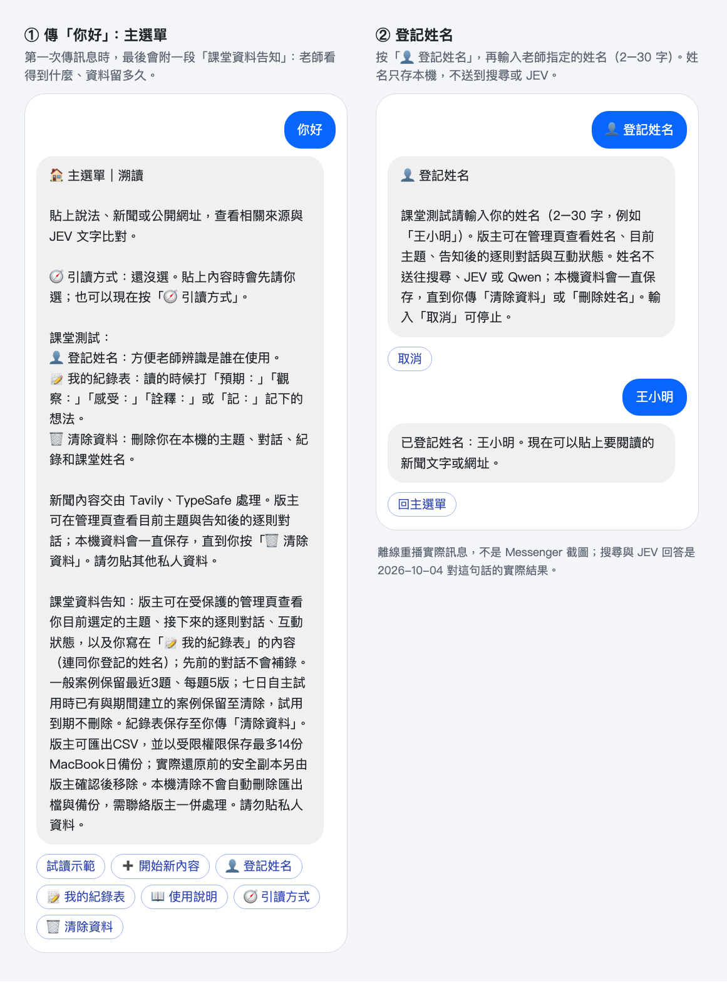

- 第一次傳訊息，會看到主選單和「課堂資料告知」：老師看得到什麼、資料留多久。請讀完。
- 按「👤 登記姓名」，輸入老師指定的姓名（2–30 字）。姓名不會送到搜尋或 JEV；老師在管理頁看得到。
- 建議先按「試讀示範」走一次。示範用的是虛構資料，只是讓你熟悉操作，**不能**用來評估機器人準不準。

### 2. 貼上句子，選引讀方式

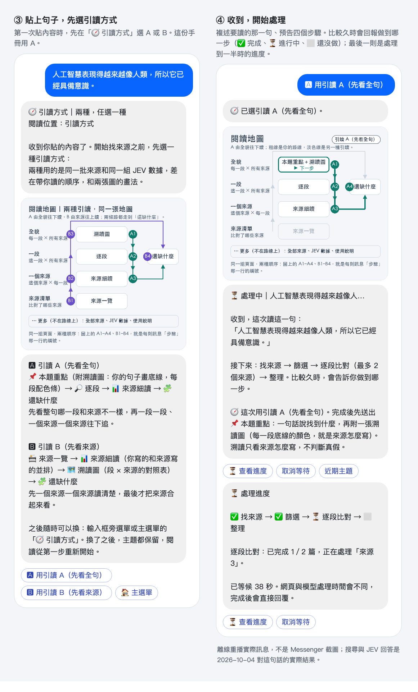

- 直接貼上句子。單句會直接找來源；貼多句或網址時，會先請你選一句。
- 第一次貼內容時，會先到「🧭 引讀方式」：圖上寫出兩種各先看到什麼，自己選一種（或照老師指定）。這份手冊用 **引讀 A**。
- 機器人先複述要讀的那一句、預告接下來的步驟。比較久時會回報做到哪一步（✅ 完成、⏳ 進行中、⬜ 還沒做）。**等著就好，不要重貼**；想知道進度就按「⏳ 查看進度」或打「進度」。

### 3. 第一步：📌 本題重點與溯讀圖

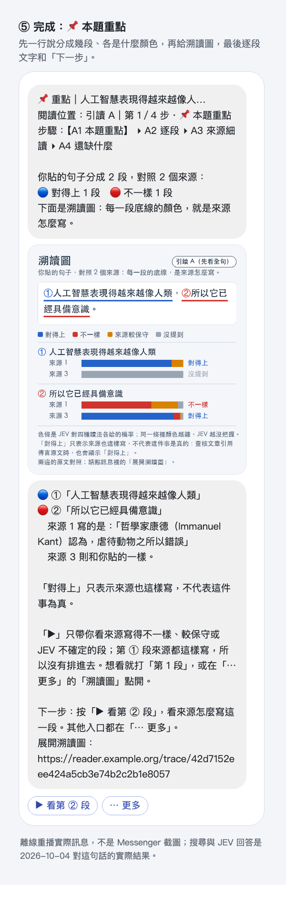

完成後第一則訊息一句話說結果：句子分成 2 段，詳細對照 2 個來源，🔵 對得上 1 段、🔴 不一樣 1 段。接著是溯讀圖：

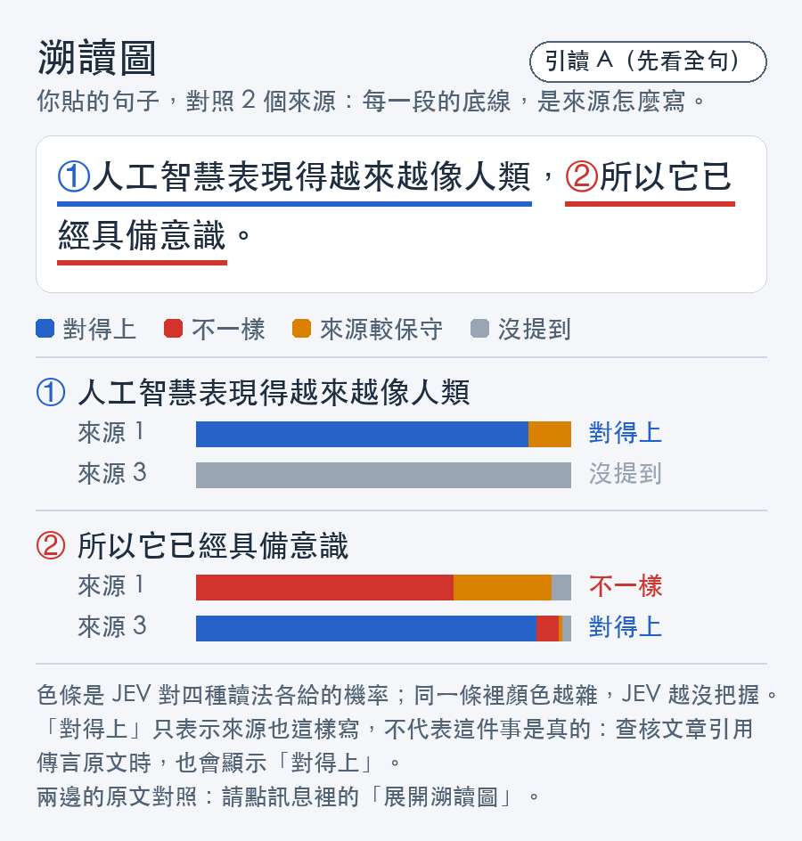

怎麼讀：

- 上面是你的句子，每一段底線的顏色就是「來源怎麼寫」。顏色：🔵 對得上、🔴 不一樣、🟠 來源較保守、⚪ 沒提到。
- 下面每一段一組色條，一個來源一條。色條是 JEV 對四種讀法各給的機率；同一條裡顏色越雜，JEV 越沒把握。
- 這個例子：段 ①「人工智慧表現得越來越像人類」來源 1 對得上、來源 3 沒提到；段 ②「所以它已經具備意識」來源 1 不一樣、來源 3 對得上。
- 文字版也寫出不一樣的地方：來源 1 在段 ② 寫的是「哲學家康德（Immanuel Kant）認為，虐待動物之所以錯誤」。

最後一行告訴你下一步：按「▶ 看第 ② 段」。▶ 只帶你看值得打開的段（不一樣、較保守、JEV 沒把握的）；段 ① 對得上，所以不在路線上，想看就打「第 1 段」。

### 4. 第二到四步：逐段、來源細讀、還缺什麼

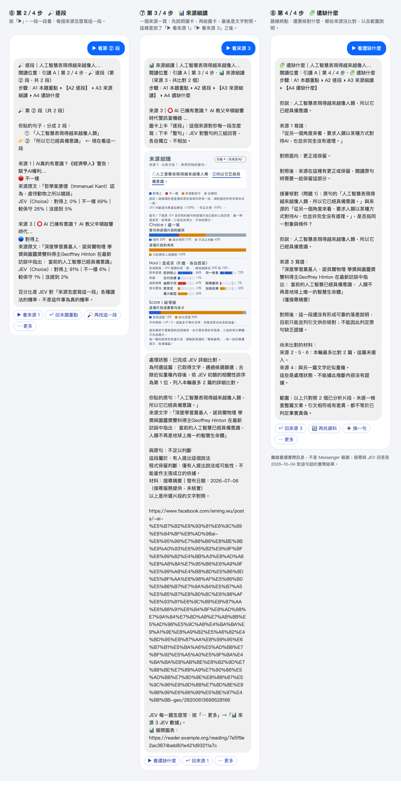

**🔎 逐段（第 2／4 步）**：一段一段看，每個來源怎麼寫這一段。第 ② 段：

- 來源 1（《經濟學人》談 AI 權利的文章，鉅亨網轉載）：🔴 不一樣，原文片段在講康德和動物；JEV（Choice）不一樣 69%。
- 來源 3（Facebook 貼文「⭕ AI 已擁有意識？AI 教父辛頓敲響時代警訊」）：🔵 對得上，原文是「Geoffrey Hinton 在最新訪談中指出：當前的人工智慧已經具備意識」；JEV（Choice）對得上 91%。
- 百分比是 JEV 對「來源怎麼寫這一段」各種讀法的機率，**不是這件事為真的機率**。

**📊 來源細讀（第 3／4 步）**：一個來源一頁，先圖卡、再文字對照。圖中是按「▶ 看來源 1」之後再按「▶ 看來源 3」的那一頁：

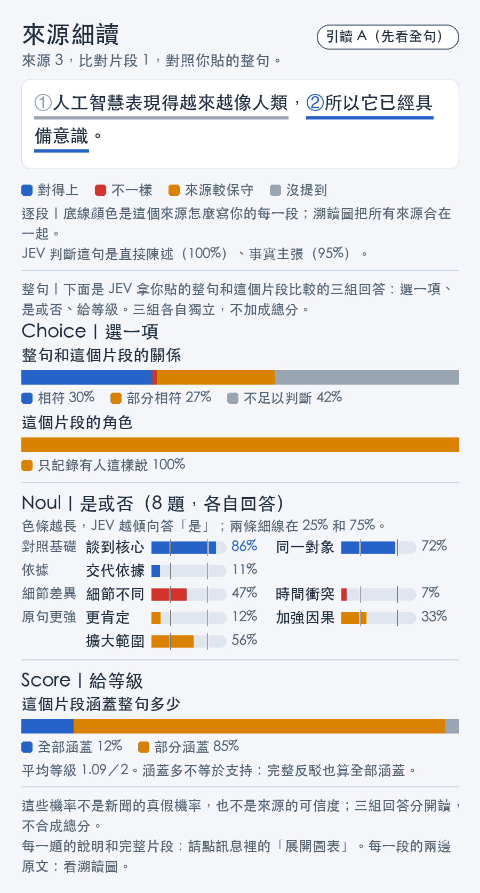

- 上半「逐段」：這個來源怎麼寫你的每一段（段 ① 沒提到、段 ② 對得上）。
- 下半「整句」：JEV 拿你的**整句**和這個片段比較的三組回答，各自獨立、不加成總分。來源 3 和整句的關係：相符 30%、部分相符 27%、不足以判斷 42%；這個片段的角色：「只記錄有人這樣說」100%。
- 文字對照的結尾寫著程式的保留判斷：「這段屬於：有人提出這個說法」「僅有人提出說法或可能性，不能當作主張成立的依據」；材料是搜尋摘要，發布日期 2026-07-06 由搜尋服務提供、未核實。
- 想看每一題的意思，按「⋯ 更多」→「📊 來源 3 JEV 數據」，或打開訊息裡的「展開圖表」網頁。

**🧩 還缺什麼（第 4／4 步）**：路線終點。列出你說了什麼、來源寫了什麼、對照後的落差，以及「接著核對」的問題（例如來源 1 的「從另一個角度來看……」和你的句子是不是同一件事）。也寫出還沒比對的來源和原因，以及範圍說明：只對照了 2 個已分析的片段，不是事實裁定。可以「🔄 再找資料」（會再花額度）或「➕ 換一句」。

### 5. 邊讀邊記：📝 使用紀錄表（五種紀錄的模擬）

讀到任何一頁，直接打字，開頭寫類別和冒號（全形「：」、半形「:」都可以）。下面是王小明讀這個例子時，五種紀錄各寫一次的實際回覆。每張手機上方的灰字是他當時在哪一頁。


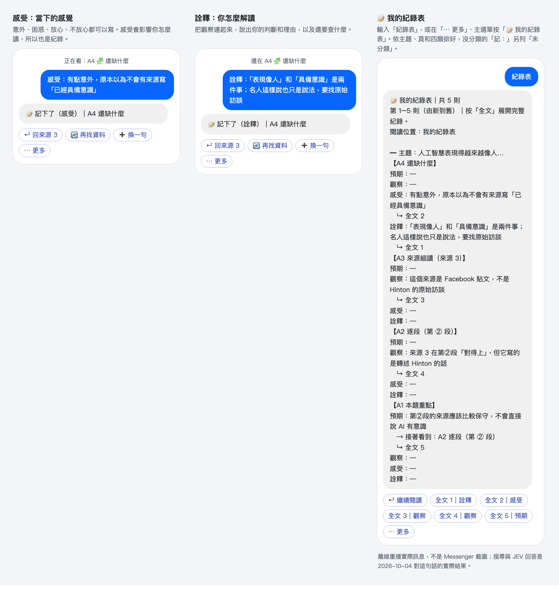

| 類別 | 什麼時候寫 | 這個例子寫的 | 機器人回覆 |
|---|---|---|---|
| 預期： | 按 ▶ **之前**，猜下一頁會看到什麼 | 在 A1 本題重點：「預期：第②段的來源應該比較保守，不會直接說 AI 有意識」 | 📝 記下了（預期）｜A1 本題重點（第一次記時，另提醒老師看得到） |
| 觀察： | 看到畫面上的事實時 | 在 A2 逐段第 ② 段：「觀察：來源 3 在第②段「對得上」，但它寫的是轉述 Hinton 的話」 | 📝 記下了（觀察）｜A2 逐段（第 ② 段） |
| 記： | 來不及想是哪一類時 | 在 A3 來源細讀（來源 3）：「記：這個來源是 Facebook 貼文，不是 Hinton 的原始訪談」，再按「🏷 觀察」 | 📝 記下了（未分類）＋四個 🏷 按鈕；按了之後「已分類：觀察」 |
| 感受： | 有感覺的當下 | 在 A4 還缺什麼：「感受：有點意外，原本以為不會有來源寫「已經具備意識」」 | 📝 記下了（感受）｜A4 還缺什麼 |
| 詮釋： | 想把看到的東西連起來、下判斷時 | 在 A4 還缺什麼：「詮釋：「表現像人」和「具備意識」是兩件事；名人這樣說也只是說法，要找原始訪談」 | 📝 記下了（詮釋）｜A4 還缺什麼 |

**怎樣算寫得好**：具體到別人看得懂你在講哪個來源、哪一段；感受和詮釋要說出「為什麼」。

| 類別 | 太籠統 | 比較好 |
|---|---|---|
| 預期： | 預期：會有結果 | 預期：第②段的來源應該比較保守，不會直接說 AI 有意識（可以對照下一頁，看猜對沒有） |
| 觀察： | 觀察：來源怪怪的 | 觀察：來源 3 在第②段「對得上」，但它寫的是轉述 Hinton 的話（寫出來源編號、哪一段、寫了什麼） |
| 感受： | 感受：還好 | 感受：有點意外，原本以為不會有來源寫「已經具備意識」（感覺加上原因） |
| 詮釋： | 詮釋：這是假的 | 詮釋：「表現像人」和「具備意識」是兩件事；名人這樣說也只是說法，要找原始訪談（判斷、理由、下一步要查什麼；不是把機器人的結果當成真假） |
| 記： | 記：？ | 記：這個來源是 Facebook 貼文，不是 Hinton 的原始訪談（先記下事實，期限前一定要分好類） |

- 記下之後，閱讀位置和選項都不變，不算一步。機器人**不回應、不糾正**你寫的內容，也不會拿去搜尋。
- 「記：」底下會多四個 🏷 按鈕可以馬上分類；不按也行，之後在紀錄表按「🏷 整理未分類」。
- 打「紀錄表」看全部：依主題、頁和四類排好，沒分類的另列「未分類」，每頁 8 則；「預期」底下寫出「→ 接著看到：…」，方便你對照猜得準不準。按「全文 N」看完整內容。
- 每筆最多保存 2,000 字；寫錯了就另補一筆更正。

### 6. 迷路時：地圖、⋯ 更多、換引讀

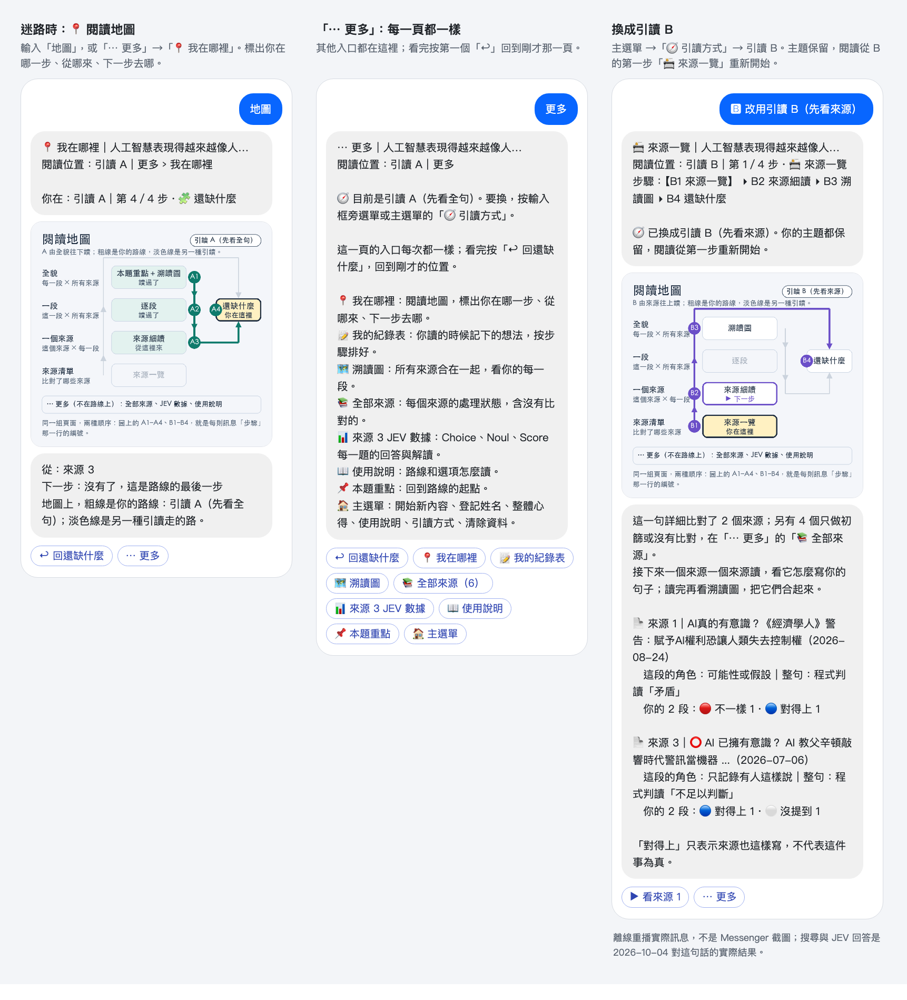

- **📍 閱讀地圖**：打「地圖」，或「⋯ 更多」→「📍 我在哪裡」。粗線是你走過的路，標出你在哪一步、從哪來、下一步去哪。
- **⋯ 更多**：每一頁都一樣，放著我在哪裡、我的紀錄表、溯讀圖、全部來源、來源 JEV 數據、使用說明、本題重點、主選單。第一個「↩」回到剛才那一頁。
- **換成引讀 B**：主選單或輸入框旁選單的「🧭 引讀方式」→ 引讀 B。主題都保留，閱讀從 B 的第一步「📇 來源一覽」重新開始：先列出這一句詳細比對了哪些來源、每個來源在你的 2 段各是什麼。

### 7. 使用說明與全部來源

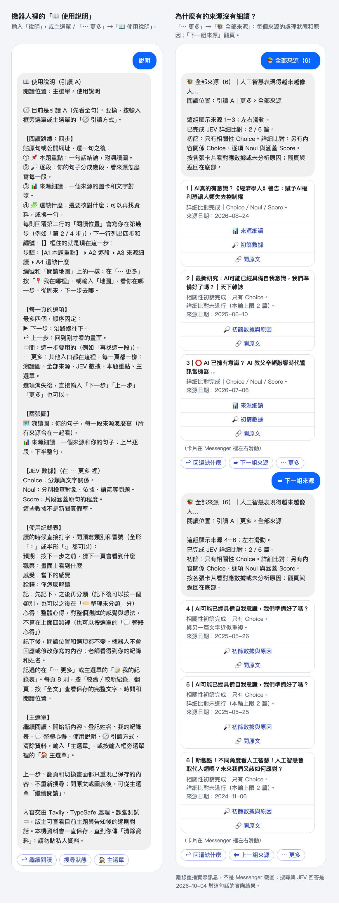

- 打「說明」，或主選單／「⋯ 更多」的「📖 使用說明」：四步、每頁選項、兩張圖、JEV 數據、紀錄表的說明都在機器人裡。
- 「⋯ 更多」→「📚 全部來源（6）」：這句話找到 6 個來源，每張卡寫出處理狀態，按「下一組來源」翻頁。
  - 來源 1、3：詳細比對完成。
  - 來源 2（天下雜誌）、5、6：只做相關性初篩；「詳細比對未進行（本輪上限 2 篇）」。
  - 來源 4：「與另一篇文字近似重複」。
  - **沒被選去細讀不代表品質比較差**，只是這一輪的處理上限。值得看的話，按「開原文」自己讀。

### 這個例子告訴我們什麼

1. **「對得上」不等於「是真的」。** 段 ② 只有來源 3 對得上，但來源 3 是一則 Facebook 貼文，轉述「Hinton 在最新訪談中指出」，不是訪談本身。程式也標出它只是「有人提出這個說法」，不能當作主張成立的依據。下一步是找原始訪談，看他實際怎麼說、在什麼脈絡下說。
2. **「所以」把兩個不同的說法接在一起。** 段 ①「表現得越來越像人類」和段 ②「已經具備意識」是兩件事，切成兩段後各自有不同的來源情況：段 ① 有新聞報導對得上，段 ② 只有轉述。就算前一段說得通，也不會讓後一段跟著成立。
3. **「不一樣」也要看是什麼不一樣。** 來源 1 在段 ② 被判「不一樣」，但它的片段在講康德和動物，跟你的句子其實不是同一件事。這是片段選得不貼題，不是來源 1 反駁了「AI 有意識」。要讀原文對照才知道。
4. **只細讀了 6 個裡的 2 個。** 其他來源的立場這次沒有比對，結論的範圍只到這 2 個片段。
5. **整句和逐段可以不一樣。** 來源 3 逐段在段 ② 對得上，但整句的 Choice 以「不足以判斷」（42%）最高，因為它完全沒談到段 ①。兩組回答分開讀，不要相加。

## 三、七日自主試用：要做什麼

老師不在場的這一週，請自己使用溯讀。重點是觀察**來源、分析和介面怎麼影響你的閱讀**，不是把機器人的結果當成真假判決。截止時間以老師公布的為準。

### 任務清單

- [ ] 傳「你好」，按「👤 登記姓名」，輸入老師指定的姓名。**沒登記姓名，老師對不到你的紀錄。**
- [ ] 先按「試讀示範」走一遍。示範是虛構資料，不能拿來評估準確率。
- [ ] 至少讀 **三篇不同的新聞**（在機器人裡，一篇就是一個「主題」）：
  - 一篇可以核對**原始公告**（例如政府、機關、公司的正式發布）；
  - 一篇有**日期或語氣差異**（例如舊聞被說成「今天」、來源說得比較保守）；
  - 一篇你認為**結果有疑問**。
- [ ] **每次貼上的內容要由 2–3 句話構成**：
  - 最好是一句裡有 2–3 個小句、用逗號連接，像本手冊的例句「人工智慧表現得越來越像人類，所以它已經具備意識。」機器人會把它切成幾段，逐段比對。
  - 如果貼的是 2–3 個用句號分開的句子，機器人會請你先選一句（「選 1」「選 2」「選 3」）；讀完可以在「🧩 還缺什麼」按「➕ 換一句」讀另一句（會再搜尋一次）。
- [ ] **引讀 A 和引讀 B 都要用**：第一次貼內容時選 A；讀完後在主選單按「🧭 引讀方式」換成 B，同一篇再讀一次（不會重新搜尋）。A、B 都要讀到「📊 來源細讀」和「🧩 還缺什麼」。
- [ ] **紀錄數量：引讀 A 和引讀 B 各自都要有預期、觀察、感受、詮釋四類，每類至少 2 筆**，也就是 A 至少 8 筆、B 至少 8 筆，合計至少 16 筆。打「紀錄表」檢查：每筆前面標著 A 或 B，例如「A2 逐段」「B1 來源一覽」。
- [ ] 「記：」寫的紀錄**一定要分類**（按 🏷，或在紀錄表按「🏷 整理未分類」）；沒分類的不算在四類裡。
- [ ] 每篇新聞讀完 A 和 B 之後，寫一筆總結（見下方「交件」）。
- [ ] 遇到問題就記一則「觀察：」問題回報。

### 紀錄怎麼寫

| 類別 | 什麼時候寫 | 例子 |
|---|---|---|
| 預期： | 按 ▶ 之前，猜下一頁會看到什麼 | 預期：來源應該有日期 |
| 觀察： | 畫面上看到什麼（具體寫哪個來源、哪一段） | 觀察：來源 2 的日期比原句早 |
| 感受： | 當下的感覺 | 感受：沒有日期讓我不放心 |
| 詮釋： | 你怎麼解讀 | 詮釋：可能是把舊聞當新消息 |
| 記： | 來不及分類，先記下 | 記：來源 3 好像是轉貼 |

**問題回報**也用「觀察：」，照這個格式寫：

```
觀察：頁名／按鈕／預期／實際／發生時間
```

例如：`觀察：A3 來源細讀（來源 3）／▶ 看還缺什麼／應該到還缺什麼／沒有回覆／10-05 21:40`。機器人只保存，不代表老師已經讀到或處理了。閱讀位置不一定等於你眼前那一頁（例如你正在看網頁圖表），所以仍請寫頁名。

注意：

- 每筆最多保存 2,000 字；要更正就再補一筆。
- 「清除資料」會連同姓名、案例和整週的紀錄一起刪掉，**刪了無法補交**。成績確認前不要清除。
- 機器人完全沒回應時，先寫在自己的文件裡並記下時間，恢復後再補記。沒收到「📝 記下了」的紀錄，不要假設已經保存。

### 交件：不用另外交

全部在溯讀裡完成。你的紀錄會自動保存，老師直接在系統裡看（連同你登記的姓名、寫的時間、用的是引讀 A 或 B、寫在哪一頁）。**以紀錄的時間為準，期限之後寫的不計分。**

每篇新聞讀完 A 和 B 之後，最後寫一筆總結，格式是：

```
詮釋：【總結】我的判讀：……；和機器人結果的差異：……；原因：……
```

這一筆也算進詮釋的數量。用本手冊的例子寫，會像這樣：

> 詮釋：【總結】我的判讀：段②只有一則 Facebook 貼文轉述 Hinton 的話，不能說 AI 已經具備意識；和機器人結果的差異：機器人顯示段②來源 3「對得上」，但那只表示有人這樣寫；原因：「對得上」只比對來源怎麼寫、不判斷真假，而且 6 個來源只細讀了 2 個，來源 1 的片段講的是康德和動物，不貼題。

評分看的是：來源能不能追溯、有沒有分開評論和事實、有沒有說明不確定的地方、能不能分析錯在哪裡；**不是**機器人回答得越肯定越好。

## 四、指令速查

不用記指令，直接用自己的話問也可以；下面是最常用的。

### 在聊天裡打字

| 打這些字 | 會做什麼 |
|---|---|
| 你好、主選單 | 主選單 |
| 示範 | 試讀示範（虛構資料） |
| 登記姓名 | 登記或修改姓名 |
| 下一步、上一步 | 和 ▶、↩ 一樣 |
| 重點 | 本題重點 |
| 第 2 段（或 ②） | 逐段的第 2 段，包括不在 ▶ 路線上的段 |
| 來源 3 | 來源 3（詳細比對過的是來源細讀） |
| 溯讀圖、看來源、還缺什麼 | 對應的頁 |
| JEV 數據、分類、逐項檢查、涵蓋 | 目前來源的 JEV 數據各頁 |
| 更多 | ⋯ 更多 |
| 地圖 | 閱讀地圖：我在哪裡 |
| 說明 | 使用說明 |
| 進度 | 目前的處理進度 |
| 近期主題、全部主題、回到 2 | 最近 3 個主題、所有保存的主題、切回第 2 個主題 |
| 預期：… 觀察：… 感受：… 詮釋：… 記：… | 記一則紀錄 |
| 紀錄表、整理未分類 | 我的紀錄表；把「記：」一則一則分類 |
| 再找研究 | 補搜尋（會花額度） |
| 清除資料 | 刪除你的資料（會先問一次） |

### 不會消失的按鈕

- **輸入框旁的固定選單**：▶ 下一步、↩ 上一步、📌 回第一步、🏠 主選單、🗂 近期主題、🧭 引讀方式。
- **主選單**：↩ 繼續閱讀（或 🗂 近期主題／試讀示範）、➕ 開始新內容、👤 登記姓名、📝 我的紀錄表、📖 使用說明、🧭 引讀方式、🗑 清除資料。

### 在自己電腦上跑（選做）

這份手冊不含程式。**只有老師另外提供程式下載時才需要這一節**：先接受老師寄來的 GitHub 私人儲存庫邀請，登入後在儲存庫頁面按 Code → Download ZIP，解壓後在含有 `classroom.py` 的資料夾開終端機（macOS 可打 `cd ` 再把資料夾拖進去按 Enter；Windows 在該資料夾開 PowerShell）。需要 Python 3.9 以上，不用另外安裝套件。

| 指令 | 做什麼 |
|---|---|
| `python3 --version` | 確認 Python 版本 |
| `python3 classroom.py demo` | 離線示範：虛構材料，不連網、不花額度 |
| `python3 classroom.py setup` | 貼上自己的 Tavily 與 TypeSafe 金鑰（輸入時看不到字是正常的） |
| `python3 classroom.py doctor` | 檢查設定欄位齊不齊（不會驗證金鑰有沒有效） |
| `python3 classroom.py analyze` | 貼一段文字，實際搜尋和比對（花自己的 API 額度） |
| `python3 classroom.py analyze --file examples/message.txt` | 分析存成 UTF-8 檔案的多行新聞 |
| `python3 classroom.py analyze --focus "原文中的一句"` | 只比對原文中的這一句（必須一字不差） |
| `python3 classroom.py analyze --export` | 另存每一步的完整資料到 `data/analysis.json`（含原文，不要上傳） |

Windows 把 `python3` 換成 `py -3`，例如 `py -3 classroom.py demo`。

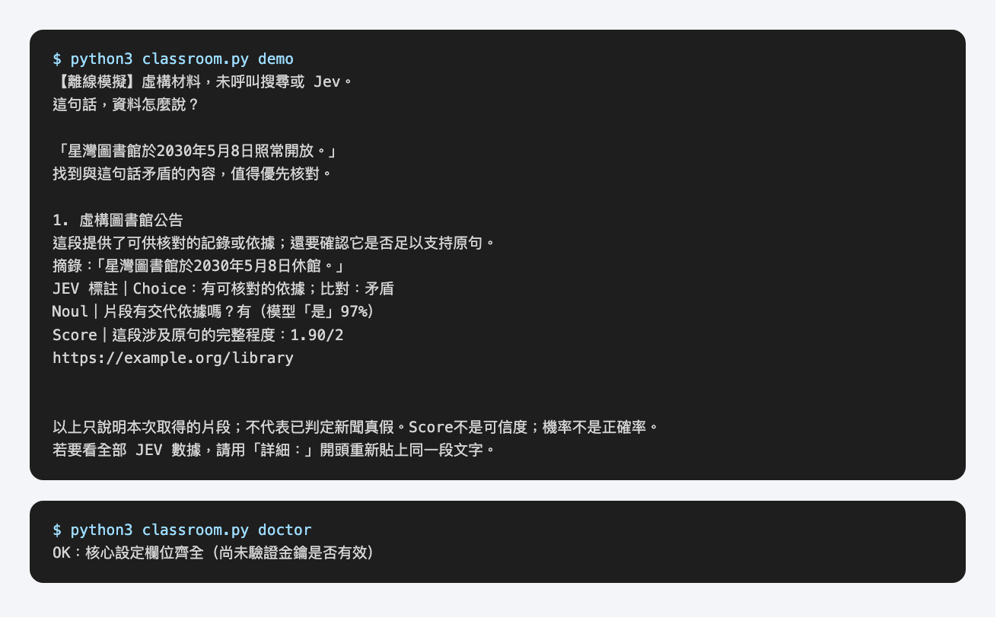

`demo` 的資料全是虛構的，只確認程式能跑，不能拿來評估準確率。`analyze` 一次只貼一則具體的消息，保留原始日期和來源名稱；「資料不足」也是合理的結果。

## 五、疑難雜症

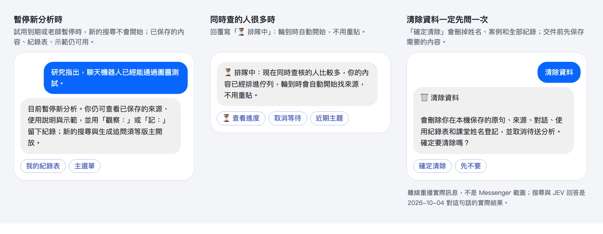

| 狀況 | 怎麼回事 | 怎麼辦 |
|---|---|---|
| 傳「你好」完全沒回應 | 可能私訊錯地方、Messenger 權限還沒開，或服務暫時離線 | 確認是用老師給的粉專私訊入口；過幾分鐘再傳一次「你好」。還是不行就把時間和狀況寫在自己的文件，告訴老師指定的聯絡人 |
| 回覆「⏳ 排隊中」 | 同時查的人很多，你的內容已排進佇列 | **不要重貼**，輪到時自動開始。按「⏳ 查看進度」看狀況，不想等就「取消等待」 |
| 等很久還沒結果 | 搜尋、讀網頁、JEV 都要時間 | 打「進度」看做到哪一步。重貼或「再找資料」會再花額度，不要一直重送 |
| 「目前暫停新分析」 | 試用到期或老師暫停 | 已保存的主題、來源、紀錄表、說明和示範都還能用，紀錄照常可以寫；新的搜尋要等老師開放 |
| 「這個按鈕屬於舊主題或已到期」 | 按了舊訊息上的按鈕，那個主題已被取代或清除 | 打「看來源」接續目前主題，或貼新內容。按到別的主題的按鈕，機器人會問要不要切回去 |
| 「這個按鈕來自引讀 B 的畫面」 | 換過引讀方式，又按了另一種的舊按鈕 | 用現在這一種的按鈕繼續；要換回去，按「🧭 引讀方式」 |
| 按鈕不見了 | 傳下一則訊息後，Messenger 會收起舊選項 | 用輸入框旁的固定選單，或直接打「下一步」「更多」「主選單」 |
| 迷路、不知道在哪 | | 打「地圖」看位置；「更多」看所有入口；主選單的「↩ 繼續閱讀」回到剛才讀的地方；按錯就按「↩」 |
| 某個來源沒有「來源細讀」 | 每句最多細讀 2 個來源；其他只有初篩、重複或被排除 | 「⋯ 更多」→「📚 全部來源」看每個來源的狀態和原因；有興趣就「開原文」自己讀 |
| 「對得上」是不是代表是真的？ | 不是。只表示來源也這樣寫 | 看來源是誰、是不是原始出處；查核文章照抄傳言再反駁，被照抄的那段也會「對得上」 |
| 為什麼 ▶ 跳過了某一段？ | ▶ 只帶你看不一樣、較保守或 JEV 沒把握的段 | 打「第 1 段」直接看 |
| 為什麼沒有總分？ | 三組回答問的是不同的題目 | 分開讀，讀完文字對照自己判斷 |
| 貼了圖片、影片或需要登入的網址 | 只能處理文字和公開可讀的網址 | 把文字複製貼上（5–20,000 字） |
| 紀錄有沒有存到？ | 存到時會回「📝 記下了（類別）｜頁名」 | 沒看到這一行就當作沒存，先記在自己的文件，之後補記 |
| 資料會留多久？ | 一般最多保留最近 3 個主題、每題 5 個版本；七日自主試用期間的案例保留到你自己清除，試用到期也不刪 | 「近期主題」看最近 3 題，「全部主題」翻頁看較早的案例；紀錄表一直保留到你清除資料 |
| 想刪掉自己的資料 | 「清除資料」會先問一次 | 按「確定清除」會刪掉姓名、主題、對話和整份紀錄表，選過的引讀也會忘記，**刪了無法補交，成績確認前不要按**。老師已匯出的 CSV、備份和 Meta 聊天紀錄不會跟著刪，要刪請聯絡老師 |
| 會不會被別人看到？ | 老師在管理頁看得到你的主題、告知後的對話和紀錄表（連同姓名） | 不要貼個資、私訊或金鑰；圖表連結誰拿到都能開，不要轉傳 |
| 本機：找不到 `classroom.py` | 終端機不在專案資料夾 | 進入解壓後含 README 的資料夾再執行 |
| 本機：`python3` 不是指令（Windows） | Windows 的 Python 指令不同 | 改用 `py -3`，例如 `py -3 classroom.py demo`；沒有就先安裝 Python 3.9 以上 |
| 本機：`doctor` 是 OK，但 `analyze` 失敗 | `doctor` 只查欄位，金鑰可能無效或額度不足 | 到 Tavily／TypeSafe 控制台查帳號與用量 |

## 用詞

| 詞 | 意思 |
|---|---|
| 段 | 你貼的句子依標點切開的一小塊，最多 6 段 |
| 片段 | 來源網頁裡被拿去比對的一小段文字，每個來源最多 3 個 |
| 來源 | 搜尋到的一個網頁 |
| 步 | 閱讀路線的四個階段 |
| 頁 | 聊天裡的一個畫面；每頁最多四個選項 |
| Choice／Noul／Score | JEV 的三組回答：選一項、是或否、給等級。不是真假機率，也不是來源可信度 |
